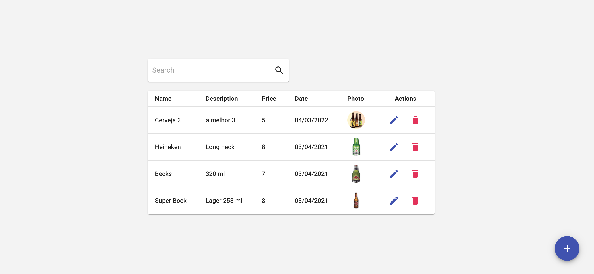

# Teste FullStack da SmartBPO

Realizar um CRUD de produtos com uma simples pesquisa na listagem.

No Backend foi utilizado: `Nodejs`, `Express` e `Mongoose`.

Banco de dados `MongoDB`.

No Frontend foi utilizado: `Reactjs`, `Typescript`, `Redux`, `Redux saga`, `Material UI`, `SweetAlert` e `Axios`.

## Configurando Backend

1. Na pasta do projeto execute **npm install** ou **yarn**.
2. Crie um arquivo **.env** na raiz do projeto e informe as variáveis de ambiente que se encontram dentro do arquivo **.env-example**.
3. Na pasta do projeto backend, execute o comando **npm run dev** ou **yarn dev**.

## Configurando Frontend

1. Na pasta do projeto execute **npm install** ou **yarn**.
2. Crie um arquivo **.env** na raiz do projeto e informe as variáveis de ambiente que se encontram dentro do arquivo **.env-example**.
3. Na pasta do projeto backend, execute o comando **npm run start** ou **yarn start**.
